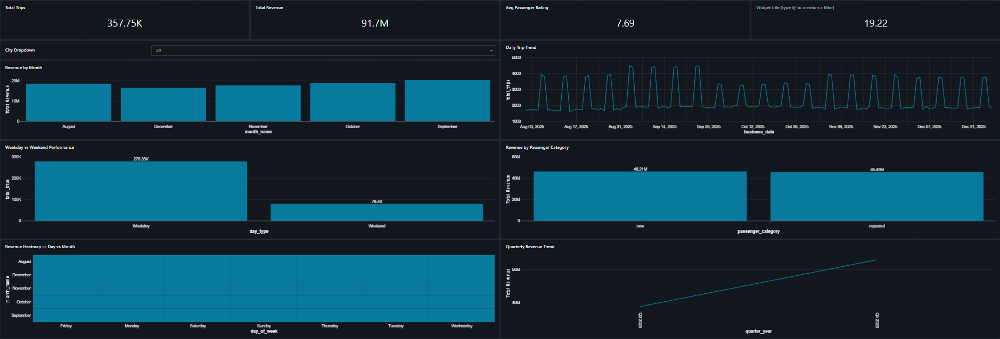

# 🚖 RouteFlow

### Regional Data Pipeline for Transportation Analytics

> A Data Engineering project using **Databricks** | **Medallion Architecture** | **Lakeflow Spark Declarative Pipelines**

---

## 📌 Table of Contents

- [Project Overview](#-project-overview)
- [Problem Statement](#-problem-statement)
- [Technology Stack](#-technology-stack)
- [Project Architecture](#-project-architecture)
- [Key Features](#-key-features)
- [Project Structure](#-project-structure)
- [How to Run](#-how-to-run)
- [Gold Layer Tables](#-gold-layer-tables)
- [Dashboard & Analytics](#-dashboard--analytics)
- [Exporting the Dashboard](#-exporting-the-dashboard)
- [Project Outcomes](#-project-outcomes)

---

## 📖 Project Overview

**RouteFlow** is a data engineering project built for **Good Cap**, a fast-growing cab service company operating across multiple cities and regions. The project addresses a critical operational challenge: regional managers were not receiving timely, region-specific data to run daily operations.

The solution adopts a **declarative pipeline approach** using **Databricks Lakeflow Spark Declarative Pipelines** to replace slow, manually orchestrated Spark jobs — delivering faster regional insights, eliminating manual rework, and restoring leadership confidence in the data platform.

---

## ❗ Problem Statement

Good Cap's existing platform relied on **tightly coupled, procedural Spark pipelines with manual orchestration**. This caused three critical failures:

- 📊 Regional managers received **generic dashboards** that were difficult to act on
- 🔄 Teams were forced to **manually export and rework data** for their specific regions
- 🚫 Platform **innovation had stalled**, eroding leadership trust in the data team

The data team was challenged to run a focused pilot proving that a new declarative approach could reduce manual effort, accelerate regional delivery, and demonstrate platform innovation.

---

## ⚙️ Technology Stack

| Component | Technology | Purpose |
| --- | --- | --- |
| Data Platform | Databricks Free Edition | Core processing, notebooks, pipelines |
| Pipeline Framework | Lakeflow Spark Declarative Pipelines | Declarative Bronze → Silver → Gold |
| Storage Layer | Databricks Volumes (DBFS) | Replaces AWS S3 for file ingestion |
| Data Governance | Unity Catalog | Catalog, schema, and access management |
| File Format | Delta Lake | ACID transactions, time travel |
| Ingestion | Auto Loader (cloudFiles) | Incremental CSV file loading |
| Version Control | GitHub + Databricks Repos | Notebook and pipeline versioning |
| BI & Reporting | Databricks Dashboards + Genie | Regional analytics and alerting |
| Orchestration | Databricks Jobs & Workflows | Scheduled pipeline execution |

---

## 🏗️ Project Architecture

### High-Level Data Flow

```
Trip Data (Simulated CSV Files)
        │
        ▼
Databricks Volumes (routeflow_raw_data)
        │
        ▼
Auto Loader (cloudFiles)
        │
        ▼
┌───────────────────────────────────────────┐
│           Databricks Workspace            │
│                                           │
│   Bronze ──► Silver ──► Gold              │
│                                           │
│   Unity Catalog + Delta Lake              │
│   Lakeflow Spark Declarative Pipelines    │
└───────────────────────────────────────────┘
        │
        ▼
BI Dashboards + Genie + Alerts
```

### Medallion Architecture

| Layer | Tables | Description |
| --- | --- | --- |
| 🥉 Bronze | raw_trips, raw_cities, raw_calendar | Raw ingestion with Auto Loader, schema rescue, no transformations |
| 🥈 Silver | trips, cities, calendar | Cleaned data, type casting, date keys, deduplication, SCD logic |
| 🥇 Gold | fact_trips, fact_trips_\<city\> | BI-ready aggregations, region-partitioned fact tables for dashboards |

### Unity Catalog Structure

```
routeflow_catalog
    └── routeflow_schema
            └── routeflow_raw_data  (Volume - stores CSV files)
            └── bronze              (Schema - raw Delta tables)
            └── silver              (Schema - cleaned Delta tables)
            └── gold                (Schema - BI-ready fact tables)
```

### Project Flow

[](https://github.com/Pratik5767/RouteFlow/blob/main/images/architecture.png)

### Pipeline Graph

[](https://github.com/Pratik5767/RouteFlow/blob/main/images/pipeline_graph.png)

---

## ✨ Key Features

### 🔷 Declarative Pipelines (Lakeflow SDP)

- Pipelines declare **what to do**, not how to do it
- Spark handles execution planning, dependency management, and incremental processing
- Eliminates manual orchestration from the previous procedural approach

### 🔷 Auto Loader Ingestion

```python
df = (
    spark.readStream.format("cloudFiles")
        .option("cloudFiles.format", "csv")
        .option("cloudFiles.inferColumnTypes", "true")
        .option("cloudFiles.schemaEvolutionMode", "rescue")
        .option("cloudFiles.maxFilesPerTrigger", 100)
        .option("cloudFiles.schemaLocation", SCHEMA_PATH)
        .load(SOURCE_PATH)
)
```

- Reads CSV files directly from **Databricks Volumes**
- Automatically infers column types and handles schema evolution
- Supports **incremental loading** — only processes new files on each run

### 🔷 Region-Partitioned Gold Layer

- Individual fact tables generated **per city**
- Regional managers get fast, pre-aggregated data without manual exports
- Directly connected to Databricks BI Dashboards

### 🔷 Jobs, Workflows & Alerts

- End-to-end pipeline scheduled via **Databricks Jobs**
- BI Dashboards built natively inside the Databricks workspace
- Alerts configured to trigger notifications on pipeline completion or data thresholds

---

## 📁 Project Structure

```
routeflow_transportation_pipeline/
  ├── transformations/
  │     ├── bronze/                     # Auto Loader ingestion notebooks
  │     │     └── city.py
  │     │     └── trips.py
  │     ├── silver/
  │     │     ├── cities.py             # City table transformations
  │     │     ├── calender.py           # Calendar table with date keys
  │     │     └── trips.py              # Trips table cleaning & SCD
  │     └── gold/
  │           └── fact_trips.py         # BI-ready aggregations per region
  │           └── fact_....py
  │           └── fact_....py
  └── project_setup.py
```

---

## 🚀 How to Run

### Step 1: Setup Catalog, Schema & Volume

```sql
-- Run in Databricks notebook
CREATE CATALOG routeflow_catalog;
CREATE SCHEMA routeflow_catalog.routeflow_schema;
CREATE VOLUME routeflow_catalog.routeflow_schema.routeflow_raw_data;
```

### Step 2: Upload CSV Files

- Go to **Data → Volumes → routeflow_raw_data**
- Upload your CSV files: `trips.csv`, `cities.csv`, `calendar.csv`

### Step 3: Connect GitHub Repo

- Go to **Repos** in Databricks workspace
- Add your GitHub repository URL
- Pull the project notebooks into your workspace

### Step 4: Configure Source Path

```python
SOURCE_PATH  = "/Volumes/routeflow_catalog/routeflow_schema/routeflow_raw_data/"
SCHEMA_PATH  = "/Volumes/routeflow_catalog/routeflow_schema/routeflow_raw_data/_schema"
```

### Step 5: Run Pipelines

- Open the **Lakeflow Declarative Pipeline** configuration
- Run Bronze → Silver → Gold in sequence
- Verify tables appear under `routeflow_catalog → routeflow_schema`

### Step 6: Launch Dashboards & Alerts

- Open **Dashboards** in the Databricks workspace
- Connect to Gold layer fact tables
- Configure alerts to trigger notifications on data thresholds

---

## 📊 Gold Layer Tables

Region-specific fact tables generated in the Gold layer:

| Table | Region |
| --- | --- |
| `fact_trips` | All regions combined |
| `fact_trips_chandigarh` | Chandigarh |
| `fact_trips_coimbatore` | Coimbatore |
| `fact_trips_indore` | Indore |
| `fact_trips_jaipur` | Jaipur |
| `fact_trips_kochi` | Kochi |
| `fact_trips_lucknow` | Lucknow |
| `fact_trips_mysore` | Mysore |
| `fact_trips_surat` | Surat |
| `fact_trips_vadodara` | Vadodara |
| `fact_trips_visakhapatnam` | Visakhapatnam |

---

## 📈 Dashboard & Analytics

The RouteFlow dashboard is built natively inside **Databricks Dashboards**, connected directly to the Gold layer fact tables. It gives regional managers a real-time, city-specific view of trip analytics — no manual exports needed.

### Gold Layer Schema

All Gold layer fact tables share the following schema:

| Column | Description |
| --- | --- |
| `id` | Unique trip identifier |
| `business_date` | Date of the trip |
| `city_id` | Unique city identifier |
| `city_name` | Name of the city |
| `passenger_category` | Category of the passenger |
| `distance_kms` | Trip distance in kilometres |
| `sales_amt` | Fare / revenue generated for the trip |
| `passenger_rating` | Rating given by the passenger (1–5) |
| `driver_rating` | Rating given to the driver (1–5) |
| `month` | Month number |
| `day_of_month` | Day of the month |
| `day_of_week` | Day of the week |
| `month_name` | Full month name |
| `month_year` | Month and year combined |
| `quarter` | Quarter number (1–4) |
| `quarter_year` | Quarter and year combined |
| `week_of_year` | Week number of the year |
| `is_weekday` | Boolean — true if weekday |
| `is_weekend` | Boolean — true if weekend |
| `national_holiday` | Boolean — true if national holiday |

### Unified Dataset (All Cities)

A single `all_cities_trips` dataset powers every widget on the dashboard. It combines all city-specific Gold tables via a UNION ALL query:

```sql
SELECT 'Chandigarh'     AS city, * FROM routeflow_catalog.routeflow_schema.fact_trips_chandigarh
UNION ALL
SELECT 'Coimbatore'     AS city, * FROM routeflow_catalog.routeflow_schema.fact_trips_coimbatore
UNION ALL
SELECT 'Indore'         AS city, * FROM routeflow_catalog.routeflow_schema.fact_trips_indore
UNION ALL
SELECT 'Jaipur'         AS city, * FROM routeflow_catalog.routeflow_schema.fact_trips_jaipur
UNION ALL
SELECT 'Kochi'          AS city, * FROM routeflow_catalog.routeflow_schema.fact_trips_kochi
UNION ALL
SELECT 'Lucknow'        AS city, * FROM routeflow_catalog.routeflow_schema.fact_trips_lucknow
UNION ALL
SELECT 'Mysore'         AS city, * FROM routeflow_catalog.routeflow_schema.fact_trips_mysore
UNION ALL
SELECT 'Surat'          AS city, * FROM routeflow_catalog.routeflow_schema.fact_trips_surat
UNION ALL
SELECT 'Vadodara'       AS city, * FROM routeflow_catalog.routeflow_schema.fact_trips_vadodara
UNION ALL
SELECT 'Visakhapatnam'  AS city, * FROM routeflow_catalog.routeflow_schema.fact_trips_visakhapatnam
```

A **city dropdown filter** is applied on top — each regional manager sees only their city's data from this one shared dataset.

### Dashboard Widgets

| Widget | Type | Metric |
| --- | --- | --- |
| Total Trips | Counter | `COUNT(id)` |
| Total Revenue | Counter | `SUM(sales_amt)` |
| Avg Passenger Rating | Counter | `AVG(passenger_rating)` |
| Avg Distance (km) | Counter | `AVG(distance_kms)` |
| Revenue by Month | Bar Chart | `SUM(sales_amt)` grouped by `month_name` |
| Daily Trip Trend | Line Chart | `COUNT(id)` grouped by `business_date` |
| Weekday vs Weekend Performance | Bar Chart | `is_weekday` / `is_weekend` flag |
| Revenue by Passenger Category | Bar Chart | `SUM(sales_amt)` grouped by `passenger_category` |
| Revenue Heatmap | Heatmap | `day_of_week` × `month_name` |
| Quarterly Revenue Trend | Line Chart | `SUM(sales_amt)` grouped by `quarter_year` |
| Trip Detail Log | Table | Full row-level detail with city filter |

### RouteFlow Dashboard



---

## 💾 Exporting the Dashboard

Since RouteFlow runs on **Databricks Free Edition**, the dashboard can be exported as a JSON definition file for backup and portability.

### Export as JSON

1. Go to **Dashboards** in the Databricks workspace
2. Find the RouteFlow dashboard
3. Click **⋮ (three dots) → Export**
4. A `.lvdash.json` file is downloaded — this is the full dashboard definition

The exported file is saved in the `/dashboard` folder in this repository.

### Re-import the Dashboard

To restore or share the dashboard in another Databricks workspace:

1. Go to **Dashboards → Import**
2. Upload the `.lvdash.json` file
3. The full dashboard is restored with all widgets and queries intact

### Export Data per Widget (CSV)

To download the raw data behind any chart:

1. Click on any widget in the dashboard
2. Click the **⋮ menu on the widget → Download data**
3. Choose **CSV** or **Excel**

---

## 🎯 Project Outcomes

| Success Criteria | Result |
| --- | --- |
| Regional managers get faster insights | ✅ Region-partitioned Gold tables per city |
| Manual data rework eliminated | ✅ Automated pipeline, no exports needed |
| Declarative approach demonstrated | ✅ Lakeflow SDP replaces procedural Spark |
| Platform innovation shown to leadership | ✅ Dashboards + Genie + Automated alerts |
| Zero cloud cost solution | ✅ 100% on Databricks Free Edition |
| City-level dashboard delivered | ✅ 10 regional views from one unified dataset |
| Dashboard portability | ✅ Exported as `.lvdash.json` for backup & sharing |

---

## 👤 Author

**Project:** RouteFlow — Regional Data Pipeline for Transportation Analytics  
**Domain:** Transportation / Cab Services  
**Platform:** Databricks Free Edition *(No cloud account required)*  
**Architecture:** Medallion (Bronze → Silver → Gold) with Lakeflow Spark Declarative Pipelines

---

> *Built as a learning and portfolio project to demonstrate real-world data engineering skills using modern Databricks tooling.*